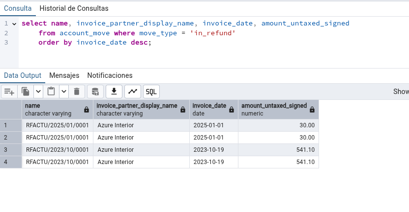

# Tarea 12 SXE
## Angel Jose Piñeiro Andion

---

## Apartado 1

### Enunciado

Como mencionamos en clase, aunque no es recomendable, en ocasiones puede ser
necesario crear tablas ajenas a Odoo dentro de su base de datos (integración con
sistemas externos, almacenamiento de históricos, datos temporales…). Mediante la
herramienta PgAdmin u otro método que estimes oportuno, elabora y ejecuta una
sentencia que cree una tabla llamada “EmpresasFCT“con los siguientes campos:

- idEmpresa: autonumérico. Este campo será la clave primaria.
- nombre: Texto con tamaño máximo de 40 caracteres. -useChatgpt: booleano, por defecto a true
- quiereAlumnos: Booleano.
- numAlumnos: número entero.
- fechaContacto: tipo fecha

    CREATE TABLE public.EmpresasFCT (
    idEmpresa SERIAL PRIMARY KEY,
    nombre VARCHAR(40),
    quiereAlumnos Boolean,
    numAlumnos integer,
    fechaContacto date
    );

Para comprobar que la tabla se haya creado correctamente ejecutamos el siguiente comando:

    select * from EmpresasFCT;

---

## Apartado 2

### Enunciado

Inserta 5 registros inventados en la tabla a través de una sentencia SQL.

    INSERT INTO public.EmpresasFCT (nombre, quiereAlumnos, numAlumnos, fechaContacto) VALUES
    ('Empresa1', true, 5, '2022-01-30'),
    ('Empresa2', false, 0, '2022-01-30'),
    ('Empresa3', true, 3, '2022-01-30'),
    ('Empresa4', false, 0, '2022-01-30'),
    ('Empresa5', true, 2, '2022-01-30');

Comprobamos que se hayan insertado correctamente los registros:

    select * from EmpresasFCT;

---

## Apartado 3

### Enunciado

Realiza una consulta donde se muestren todos los datos de la tabla EmpresasFCT
ordenados por fechaContacto, de modo que en la primera la salga el que tenga la
fecha más reciente.

    select * from EmpresasFCT order by fechaContacto desc;

---

## Apartado 4

### Enunciado

Realiza una consulta que permita obtener un listado de todos los contactos de
Odoo (no empresas) con la siguiente información:
- Nombre
- Cuya ciudad sea Tracy, y código postal 95304
- Nombre comercial de la empresa

ordenados alfabéticamente por el nombre comercial de la empresa.

    select c.name, c.city, c.zip, p.name from res_partner c
    inner join res_partner p on c.parent_id = p.id
    where c.city = 'Tracy' and c.zip = '95304'
    order by p.name;

---

## Apartado 5

### Enunciado

Utilizando las tablas de odoo, obtén un listado de empresas proveedoras, que han
emitido algún reembolso (facturas recticativas de proveedor)
- Nombre de la empresa
- Número de factura
- Fecha de la factura-total de factura con impuestos
- Total factura SIN impuestos
- 
Ordenadas por fecha de factura de modo que la primera sea la más reciente

    select name, invoice_partner_display_name, invoice_date, amount_untaxed_signed 
    from account_move where move_type = 'in_refund'
    order by invoice_date desc;

